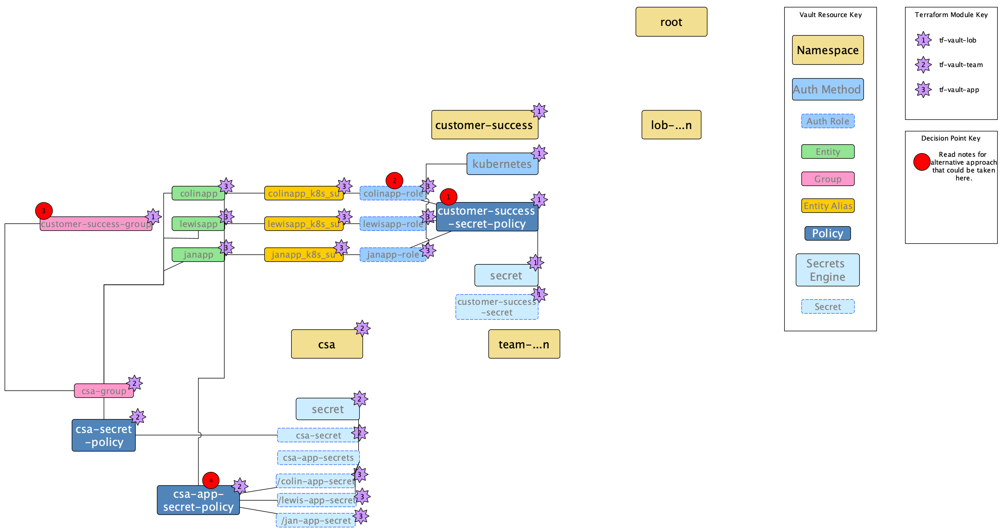

# Vault Namespaces with Terraform and Kubernetes POC

Configuring a Vault dev server with multiple namespaces using Terraform

## Aim

This demo aims to demonstrate the following, for the following reasons:

* How to configure the Vault application with Terraform
    * Why? Because Terraform is HashiCorp's recommended method of configuring the Vault application.
* How an organisational structure could be loosely represented in Vault using Namespaces in a scalable fashion.
    * Why? Because Namespaces are useful for higher-level segregation of secrets and delegation of administration of policy in Vault.
* How Vault clients authenticating via an auth method hosted on a parent namespace could access secrets stored on a child namespace.
    * Why? Because many organisations may co-host multiple applications on Kubernetes, whilst still requiring some level of separation of management of their secrets due to team structures.

## Scenario

The scenario is very loosely based on the HashiCorp Customer Success organisational/LOB structure, within which there are two teams- Customer Success Architecture (CSA) and Customer Success Management (CSM).

A Kubernetes cluster (for the purposes of this demo, a local Minikube deployment) is aligned to each LOB and shared across multiple teams. Three applications, colinapp, lewisapp and janapp, are managed
by the CSA team and deployed on the cluster. Secrets need to be accessed by the applications in the following situations:

* The secret at `customer-success/secret/customer-success-secret` should be accessible by any app that is a member of the customer-success LOB.
* The secret at `customer-success/secret/csa/secret/csa-team-secret` should only be accessible by any app that is a member of the customer-success team.
* The secret at `customer-success/secret/csa/secret/csa-app-secrets/{appname}-app-secret` should only be accessible by that given app.

### Architecture

* Vault Resource Key: Denotes the types of Vault resources being represented on the attached diagram.

* Terraform Module Key: Denotes the Terraform module being used to create Vault resources.

* Decision Point Key: Denotes alternative approaches that could be made at certain places in the architecture.

#### Decision Points

The following are decisions that could be made for different approaches with the architecture.

1. `customer-secret-policy` is being attached to the kubernetes role. An alternative approach would have been to attach it to the customer-success-group.

2. Multiple roles (e.g. `colinapp-role`,`lewisapp-role`) are being defined on each namespace. Since these are all linked to the same Vault policy and the same Kubernetes 
namespace, a single role could just be used for the multiple Kubernetes service accounts to authenticate to.

3. The entities created at the `customer-success` namespace level could be directly made members of the `customer-success-group` internal group, rather than indirectly made members of it through 
their membership of the `csa-group` internal group on the `csa` namespace.

4. `csa-app-secret-policy` could equally just be made part of the csa-secret-policy, or attached directly to the `csa-group` internal group, since it uses policy path templating.

## Running the Demo

### Pre-Requisites

* Minikube (tested using v1.22.0)
* Vault Enterprise (tested using Vault v1.8.4+ent)
* Terraform (tested using Terraform v1.0.10)

All of which were tested running on MacOS Big Sur 11.6

### How to Stand Up

1. Start minikube with a `minikube start`
2. Initialise Vault by running `./0-init-vault.sh`
3. Once Minikube has started, deploy the Vault Agent Injector Helm chart `./1-deploy-agent-injector.sh`
4. Next, deploy all resources using Terraform by running `terraform init`;`terraform plan`;`terraform apply` in the `terraform/tf-control/dev` directory. Be
careful to correctly set the minikube cluster IP in the `terraform.tfvars` file. You can get this by running a `minikube ip`.
5. `cd` back to the POC root directory and then run `./3-deploy-apps.sh` to deploy the apps onto Kubernetes
6. Follow the instructions in the output of this script to open the relevant pages on each nginx container web server. They'd be
    * `/cs.html` to access the customer-success specific secret.
    * `/csa.html` to access the csa-team specific secret.
    * `/colinapp.html` or `/lewisapp.html`, depending on the app, to access the app-specific secret.

## Further Considerations

* This POC currently performs all Terraform operations in a single root module/state/workspace which would not scale well in larger organisations. Instead, a better approach would be to segregate based upon 
  who is responsible for administering those resources. This advice is as per what is recommended in the [Namespaces and Mount Structuring Recommended Pattern](https://learn.hashicorp.com/tutorials/vault/namespace-structure)- to move delineation of administrative boundaries into the orchestration/self-service layer, anyway.
* Since the POC currently only uses Terraform OSS, Sentinel (Policy-as-Code) isn't yet an option. However, with the recommendation of moving delineation of administrative boundaries onto the onboarding/self-service layer (i.e. Terraform), this suggests that a separation of the Vault resources being created based upon application boundaries probably makes more sense. Therefore, Sentinel would play an important part in policing what operations would be authorised on the onboarding/self-service layer.

## Recommended Reading

* The [Namespaces and Mount Structuring Recommended Pattern](https://learn.hashicorp.com/tutorials/vault/namespace-structure) is an important piece of reading. It helps to explain how to onboard applications onto Vault at scale and to delineate between them correctly.

Other useful topics to be familiar with include:
* [Vault ACL Policy Templating](https://learn.hashicorp.com/tutorials/vault/policy-templating)
* [Vault Identity Secrets Engine](https://www.vaultproject.io/docs/secrets/identity)
* [Vault Mount Bound Aliases](https://www.vaultproject.io/docs/concepts/identity#mount-bound-aliases)
* [Terraform Vault Provider](https://registry.terraform.io/providers/hashicorp/vault/latest/docs)
* [Vault Kubernetes Integration](https://www.vaultproject.io/docs/platform/k8s), specifically the agent injector

# Support

Note that no warranty is given or implied with this POC. It doesn't claim to be production ready. In production Vault environments for example:

1. Never run Vault in dev mode.
2. Revoke your initial root token and use a less-privileged means of authentication as soon as you can.
3. Store your unseal/recovery keys separately and securely, with them allocated to individual key holders.